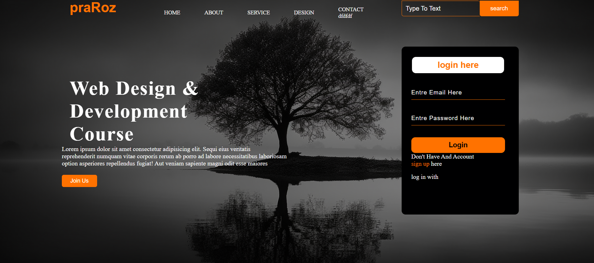

# Web Design & Development Course – Landing Page

This project is a responsive **landing page** designed using **HTML and CSS**.  
It showcases a modern UI layout that includes:

- Navigation Bar  
- Search Box  
- Hero Section with Background Image  
- Course Title & Description  
- "Join Us" CTA Button  
- Login Form (Email + Password)  
- Footer Links

---

## 🚀 Features

### 🔸 Modern & Clean UI
A dark theme layout with orange highlights to give a professional look.

### 🔸 Fully Responsive Layout
Optimized for desktop; can be extended for mobile responsiveness.

### 🔸 Login Section
A simple login card with:
- Input fields
- Login button
- Sign-up link

### 🔸 Smooth Typography
Styled headings and text for a premium landing-page feel.

---

## 📂 Project Structure

> *(You can adjust the structure based on your project.)*

---

## 🛠️ Technologies Used

- **HTML5**
- **CSS3**
- (Optional) Google Fonts / Icons

---

## 📸 Screenshot

Replace the image path with your actual screenshot file name.

---

## 📌 How to Run

1. Download or clone the repository:

